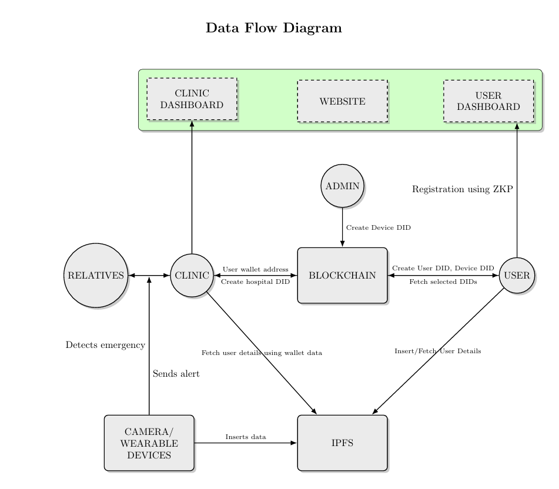
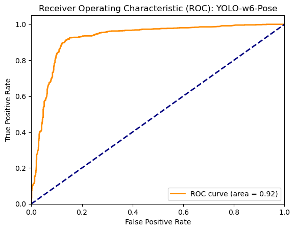
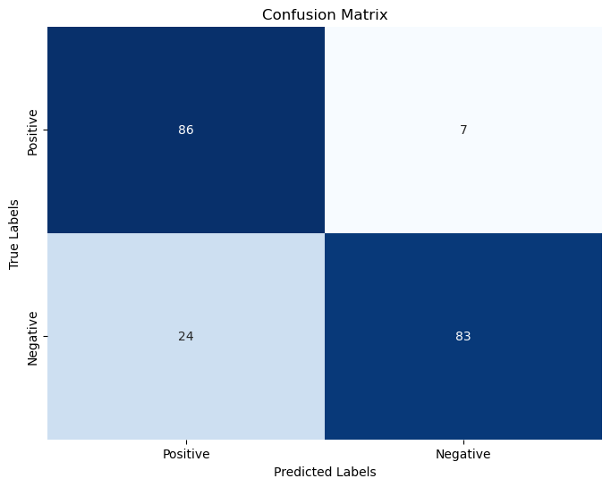

# Introduction

A collaborative project between CUSAT and Homomorphic Software Pvt Ltd with a grant from Ethereum foundation.

## Data Flow Diagram

Below is the Data Flow Diagram (DFD) that outlines the flow of data across the system:



## YOLOv7-W6-Pose Model

### Base Model Performance: 
1. Resolution: 1280
2. Average Precision (AP): 54.9%
3. Recall: 25.1%
4. Train/Box Loss: 1.8%
5. Train/Class Loss: 0.0%
6. Train/Object Loss: 0.6%
7. Val/Box Loss: 2.8%
8. Val/Class Loss: 0.0%
9. Val/Object Loss: 1.5%
10. Learning rate: 0.00447
11. AP50 (50% IoU): 72.6%
12. AP75 (75% IoU): 60.1%
13. Average fps: ~10
14. Latency: ~100 ms

### Metrics:
1. Cohen's Kappa Score: 0.69
2. Accuracy: 84.5%




## Installation

This project uses a monorepo structure that includes both front-end and back-end components. To get started, run the following commands:

```bash
# Install dependencies for both front-end and back-end
npm install

# Run the front-end development server
npm run dev-fe

# Run the back-end development server
npm run dev-be

# Run camera (currently on laptop)
npm dev-camera

# Run odroid
npm dev-odroid
```


## Purpose of each module:

# Frontend
A client side for both user & hospital. 
User can view their fall details/close contacts/profile/hospital/devices.

# Backend
This handles all the functionalities like authentication/fall data/whatsapp messages to close contacts/user data/communicating with blockchain & IPFS/etc.

# Camera
This is the code that's supposed to run inside the camera. It detects a fall and sends the details to the backend.

# Odroid
This regularly listens for data from the wearable device. If it detects a fall, it also sends the details to the backend.
